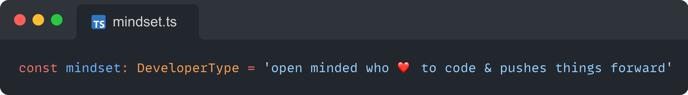

# Hi 👋, I'm Sebastian Wessel
A passionate, full-time typescript/javascript developer who is working as a freelancer.

## Opensource projects

|   |   |
|---|---|
| A Practical Guide to Understanding and Customizing Large Language Models with RAG and Function Calling |  |
| **[BuildOwn.AI](https://buildown.ai)** | [Get The Book](https://buildown.ai/book/buy) |
| **PURISTA** - THE TYPESCRIPT BACKEND FRAMEWORK | [purista.dev](https://github.com/puristajs/purista) |
| **SurrealDB Generator** - Client & Zod Schema | [surrealdb-client-generator](https://github.com/sebastianwessel/surrealdb-client-generator) |

## Freelance projects

I'm open to cool projects around typescript - no matter if it is on small IoT & embedded edge devices or at large-scale cloud.  
**Feel free to contact me, if you've some cool remote projects.**

## My current tech stack

- Node.js / Bun
- TypeScript, Jest, Testcontainer, Turbo, ESLint & Co
- PURISTA framework (OpenTelemetry, MQTT, RabbitMQ, NATS, k8s, Redis, Dapr...)
- DrizzleORM with MySQL
- SurrealDB
- Vue
- Docker / Docker-Compose
- git

## Articles on Dev.to

Check out my articles on [dev.to](https://dev.to/sebastian_wessel) 🔖📖📚🤓

<table>
        <tr>
            <td width="300px"></td>
            <td>
                <a href="https://dev.to/sebastian_wessel/how-to-design-a-surrealdb-schema-and-create-a-basic-client-for-typescript-o6o">How to Design a SurrealDB schema and create a basic...</a>
                
In the midst of a dynamic landscape of exciting new projects, one name shines bright —...

                
<i>17/09/2023</i>

            </td>
        </tr>
        <tr>
            <td width="300px"></td>
            <td>
                <a href="https://dev.to/purista/purista-tests-with-jest-sinonjs-and-testcontainers-31lh">PURISTA - Tests with Jest, Sinon.js and Testcontainers</a>
                
In the journey of crafting the PURISTA TypeScript backend framework, the need for automated software...

                
<i>12/09/2023</i>

            </td>
        </tr>
        <tr>
            <td width="300px"></td>
            <td>
                <a href="https://dev.to/purista/purista-build-with-rimraf-esbuild-turbo-git-cliff-5h5e">PURISTA: Build with rimraf, esbuild, Turbo &amp; git-cliff</a>
                
In our previous article, we laid the foundation with a glimpse of our coding setup.  It&#39;s now time to...

                
<i>11/09/2023</i>

            </td>
        </tr>
        <tr>
            <td width="300px"></td>
            <td>
                <a href="https://dev.to/purista/purista-thanks-to-amazing-open-source-software-4k2e">PURISTA - Thanks to amazing open-source software</a>
                
Welcome to our series on the unsung heroes behind PURISTA!  Ever wondered about PURISTA? It&#39;s not...

                
<i>11/09/2023</i>

            </td>
        </tr>
        <tr>
            <td width="300px"></td>
            <td>
                <a href="https://dev.to/sebastian_wessel/surrealdb-improve-data-integrity-by-adding-schema-information-3ee3">SurrealDB - Improve data integrity by adding schema information</a>
                
In the concluding chapter of this series, we&#39;ll delve into the intriguing world of SurrealDB&#39;s schema...

                
<i>08/09/2023</i>

            </td>
        </tr>
        <tr>
            <td width="300px"></td>
            <td>
                <a href="https://dev.to/sebastian_wessel/surrealdb-query-and-combine-data-via-relations-5863">SurrealDB - Query and combine data via relations</a>
                
In the previous article of this series, we set up the foundation and added some sample data.  Now,...

                
<i>08/09/2023</i>

            </td>
        </tr>
        <tr>
            <td width="300px"></td>
            <td>
                <a href="https://dev.to/sebastian_wessel/surrealdb-structuring-data-for-multi-tenant-role-permission-systems-4hmb">SurrealDB - Structuring Data for Multi-Tenant Role &amp; Permission Systems</a>
                
Let&#39;s dive into the vision of what we&#39;re aiming to create.  Our goal is to develop a versatile...

                
<i>08/09/2023</i>

            </td>
        </tr>
        <tr>
            <td width="300px"></td>
            <td>
                <a href="https://dev.to/sebastian_wessel/surrealdb-the-magic-database-to-keep-on-your-radar-4a22">SurrealDB  - The Magic Database to Keep on Your Radar</a>
                
As a TypeScript backend developer, I&#39;ve been juggling various projects, and one particular challenge...

                
<i>08/09/2023</i>

            </td>
        </tr>
        <tr>
            <td width="300px"></td>
            <td>
                <a href="https://dev.to/sebastian_wessel/bun-10-javascript-meets-speed-of-light-4hfn">Bun 1.0 - JavaScript meets speed of light</a>
                
Yesterday, version 1.0 of Bun was officially unveiled, and now it&#39;s here, ready for use.  This marks...

                
<i>07/09/2023</i>

            </td>
        </tr>
        <tr>
            <td width="300px"></td>
            <td>
                <a href="https://dev.to/sebastian_wessel/one-more-thing-apples-push-on-web-apps-on-macos-2052">One more thing - Apple&#39;s push on web apps on...</a>
                
The Conclusion of WWDC2023 Keynote: Apple&#39;s Unexpected Emphasis on Websites and Web Apps on...

                
<i>05/06/2023</i>

            </td>
        </tr>
</table>
